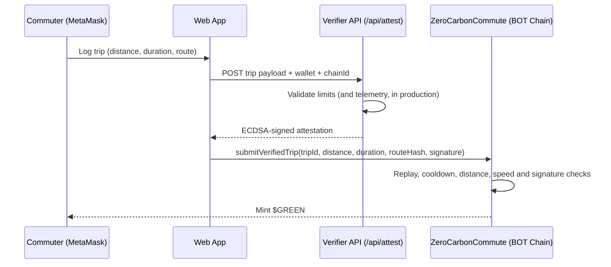

# 🌱 ZeroCarbon Commute

**A verified green-commute rewards protocol on BOT Chain.**

ZeroCarbon Commute is a software-only DePIN (Decentralized Physical Infrastructure Network) protocol that rewards walking, cycling and scootering with real ERC-20 **$GREEN** tokens. Trips are attested by an off-chain verifier, and the smart contract independently enforces speed, distance, cooldown and anti-replay rules before minting anything.

> **Network:** BOT Chain Testnet (Chain ID `968`)
> **Status:** Hackathon prototype, verified end-to-end on testnet (backend attestation → on-chain mint). Telemetry is simulated in the demo (see [Limitations](#limitations--roadmap)). Mainnet deployment is planned but not yet live.

---

## The problem

Cities and organizations want to encourage zero-emission commuting, but reward apps are easy to game. Users spoof GPS, log car rides as bike trips, or replay the same trip repeatedly. Fighting this with manual review is slow and expensive.

## The solution

ZeroCarbon Commute splits trust in two:

1. **Off-chain verifier** checks the trip and signs an attestation with its private key.
2. **On-chain contract** re-checks the hard rules itself and verifies the verifier's signature before minting.

The contract never trusts the user's numbers on their own. A trip only pays out if it passes both layers.

---

## How it works



The signed message binds together: the user's wallet, the contract address, the trip ID, distance, duration, route hash and the chain ID. That stops a signature from being reused by another wallet, on another deployment, or on another chain.

---

## Features

- **Real ERC-20 token.** $GREEN is transferable and minted directly to the commuter.
- **ECDSA signature attestation.** Only trips signed by the configured `verifierAddress` are accepted.
- **On-chain speed check.** Average speed above 25 km/h is rejected, which filters out cars.
- **Anti-replay.** Every `tripId` can be processed once.
- **Anti-spam.** A cooldown between submissions per wallet, plus a per-trip distance cap.
- **Supply cap.** Total supply can never exceed 10,000,000 $GREEN.
- **Active network guard.** The app checks MetaMask's live chain ID (not a cached value) before every submission, and proactively requests a network switch if the wallet is connected to the wrong chain.
- **Admin controls.** The owner can rotate the verifier key and adjust the cooldown.
- **Glassmorphism web UI** with a built-in transit simulator (Walk, Bike, Car) so anyone can test both successful claims and fraud rejections.

## Contract parameters

| Parameter | Value |
|---|---|
| Token | Zero Carbon Token (`GREEN`), 18 decimals |
| Reward | 10 $GREEN per km |
| Max average speed | 25 km/h |
| Max trip distance | 100 km |
| Cooldown | 1 hour per wallet (owner-adjustable) |
| Max supply | 10,000,000 $GREEN |
| Built with | Solidity `^0.8.20`, OpenZeppelin (ERC20, Ownable, ECDSA, ReentrancyGuard) |

**Public functions:** `submitVerifiedTrip(...)`, `balanceOf(address)`, `totalDistanceMeters(address)`, `verifierAddress()`, `processedTrips(bytes32)`, `lastTripTimestamp(address)`.
**Owner-only:** `setVerifierAddress(address)`, `setCooldownPeriod(uint256)`.

---

## Project structure

```
zerocarbon-commute/
├── index.html                # Web app (ethers.js v5, no build step)
├── api/
│   └── attest.js             # Vercel serverless verifier (signs attestations)
├── contracts/
│   └── ZeroCarbonCommute.sol # Smart contract
├── package.json
├── .gitignore
└── README.md
```

---

## Getting started

### 1. Deploy the contract

Deploy `ZeroCarbonCommute.sol` (for example with Remix) to BOT Chain Testnet, passing the **verifier wallet's address** to the constructor. Use a dedicated wallet for this that holds no funds.

```js
// Generate a verifier wallet once, locally
const w = ethers.Wallet.createRandom();
console.log(w.address);      // -> constructor argument / setVerifierAddress
console.log(w.privateKey);   // -> VERIFIER_PRIVATE_KEY (keep secret, never commit)
```

### 2. Configure the verifier API

Set these environment variables (Vercel: Project → Settings → Environment Variables, or `.env.local` for local dev), then redeploy:

| Variable | Value |
|---|---|
| `VERIFIER_PRIVATE_KEY` | Private key of the verifier wallet |
| `CONTRACT_ADDRESS` | Your deployed contract address |
| `CHAIN_ID` | `968` for BOT Chain Testnet |

### 3. Configure the frontend

In `index.html`, update the configuration block:

```js
const contractAddress = "0x...";           // your deployed contract
const EXPECTED_CHAIN_ID = 968;             // block wrong-network submissions
const LOCAL_SIGNING_FOR_TESTING = false;   // false = use /api/attest
```

### 4. Run it

```bash
npm install
npm i -g vercel
vercel dev          # serves the page and /api/attest at http://localhost:3000
```

Open `http://localhost:3000`, connect MetaMask on BOT Chain Testnet and submit a trip.

> **Quick UI-only testing:** set `LOCAL_SIGNING_FOR_TESTING = true` to sign with the connected wallet instead of calling the API. This only works when that wallet **is** the contract's `verifierAddress`, and must never be enabled in production. Serve the page over `http://localhost` (for example `python -m http.server 8000`), because MetaMask does not inject into `file://` pages.

---

## Demo guide

| Profile | Distance | Duration | Avg speed | Expected result |
|---|---|---|---|---|
| 🚴 Bicycle | 5,000 m | 1,200 s | 15 km/h | ✅ Minted: 50 $GREEN |
| 🚶 Walking | 2,000 m | 1,440 s | 5 km/h | ✅ Minted: 20 $GREEN |
| 🚗 Automobile | 20,000 m | 1,200 s | 60 km/h | ❌ Rejected: speed exceeds threshold |

Other behaviours to try:
- Submit twice in a row: rejected by the **cooldown**.
- Use a distance over 100 km: rejected by the **distance cap**.
- Connect a wallet that is not the verifier while in local signing mode: rejected by the **signature check**.

Only one trip per wallet per cooldown window is accepted, so use a fresh wallet (or lower the cooldown as owner on testnet) to run several tests.

---

## Security model

- The contract trusts exactly one signer: `verifierAddress`. Protect that key. Keep it in server-side secrets or a KMS/HSM, never in the frontend or the repo.
- The verifier service recomputes the signed hash itself and mirrors the contract's limits, so it never signs a trip the contract would reject.
- The owner can change the verifier and cooldown. On mainnet, transfer ownership to a multisig.
- To rotate a compromised verifier key: generate a new wallet, call `setVerifierAddress`, then update `VERIFIER_PRIVATE_KEY`.

## Limitations & roadmap

This is a prototype, and it is honest about what is and isn't implemented.

**Current limitations**
- **Telemetry is simulated.** The demo lets the user type distance and duration. Fraud resistance in production depends on the verifier validating real device data before it signs.
- **On-chain checks are limited to** average speed, distance cap, cooldown, replay protection and signature validity. The `routeHash` is stored as an opaque commitment; the contract does not analyse route coordinates or acceleration.
- **The verifier is a trusted party.** If its key is compromised, an attacker can mint up to the supply cap.
- **Unaudited.** Do not deploy with real value before an independent review.

**Roadmap**
- [ ] Real mobile GPS/sensor telemetry pipeline feeding the verifier
- [ ] Off-chain acceleration and route-plausibility analysis before signing
- [ ] Rate-limiting and monitoring on the verifier API
- [ ] Multisig ownership and a verifier key-rotation runbook
- [ ] Security audit
- [ ] Mainnet deployment
- [ ] Municipal / carbon-offset token integrations

---

## Tech stack

Solidity · OpenZeppelin · ethers.js v5 · MetaMask · Vercel serverless functions · vanilla HTML/CSS/JS
